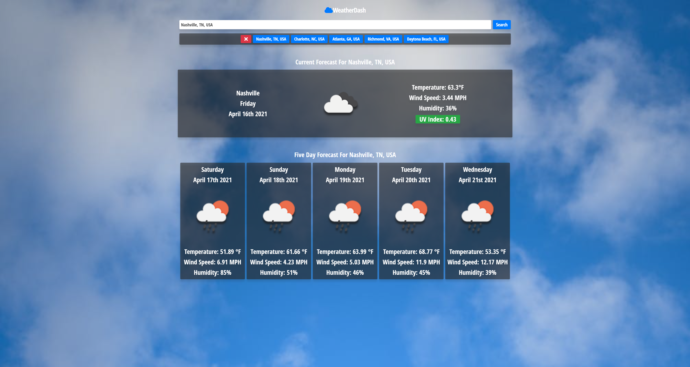

# Weather Dash

## Description

This is a weather dashboard that displays the current forecast for the users searched location, as well as a five day forecast for the location. The users previously searched locations are appended to a button, and saved to local storage. The user can click the button to see the forcast for that location again. Clicking the red X button deletes the saved locations individually, starting with the oldest location searched.

The UV Index has a background color that will change depending on the current UV index, with green being safest, and red being dangerous.

The application was created using HTML, CSS, and Javascript. The application uses the Open Weather API, Font Awesome icons, Google Fonts, and Moment JS to display the current date.

## Usage

Enter the desired location in the search bar, and press submit, or hit enter. This will get the current forecast and a five day forecast of the location.

[https://dbernard87.github.io/javascript-weather-dash/]

## Features

- Open Weather API
- Current Forecast
- Five Day Forecast
- UV Index with color changing background.
- Moment JS

## Credits

- David Bernard : [https://github.com/dbernard87]
- Icons from Font Awesome : [https://fontawesome.com/]
- Stack Overflow : [https://stackoverflow.com/]
- w3schools : [https://www.w3schools.com/]
- MDN Documentation : [https://developer.mozilla.org/en-US/]
- Open Weather API [https://openweathermap.org/api]